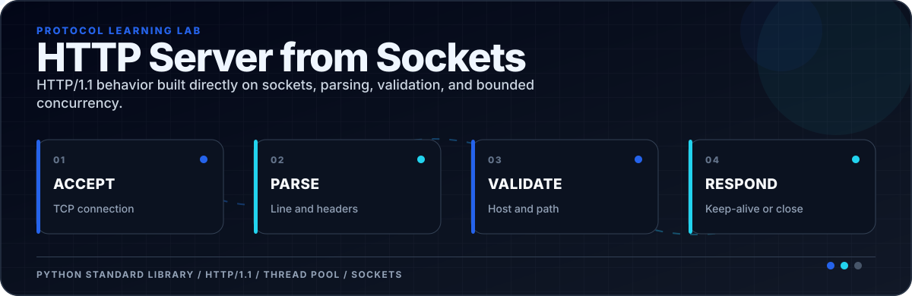
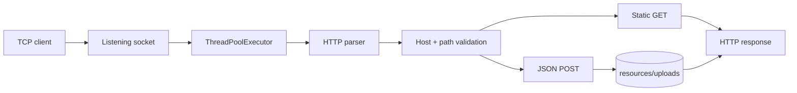

<div align="center">



</div>

[](./Server.py)
[](./Server.py)
[](./Server.py)

**A learning implementation of an HTTP/1.1 server built directly on Python sockets.**

The server parses request lines and headers, validates the `Host` header and requested path, serves local resources, accepts JSON uploads, supports keep-alive connections, and bounds concurrency with a thread pool.

## Request path



## Run

```bash
git clone https://github.com/ReaperXD67/NetworkingProject.git
cd NetworkingProject/Server\ Implemntation
python ../Server.py
```

Then open [http://127.0.0.1:8080](http://127.0.0.1:8080). `Server.py` serves a directory named `resources`, so run it from `Server Implemntation` unless you move that folder beside the script.

Example JSON upload:

```bash
curl -X POST http://127.0.0.1:8080 \
  -H "Host: 127.0.0.1:8080" \
  -H "Content-Type: application/json" \
  -d '{"message":"hello from the socket client"}'
```

## Implemented protocol behavior

- `GET` for HTML and selected binary resources.
- `POST` with `application/json`, persisted under `resources/uploads`.
- `400`, `403`, `404`, `405`, `415`, and `500` responses.
- HTTP/1.1 keep-alive with a request cap and socket timeout.
- Path traversal checks and a localhost-only `Host` allowlist.
- Timestamped per-thread logs.

## Learning scope

This is not a replacement for a hardened server such as Caddy, Nginx, or a production ASGI server. It does not implement TLS, chunked transfer encoding, streaming request bodies, complete MIME handling, or a standards-complete parser.
